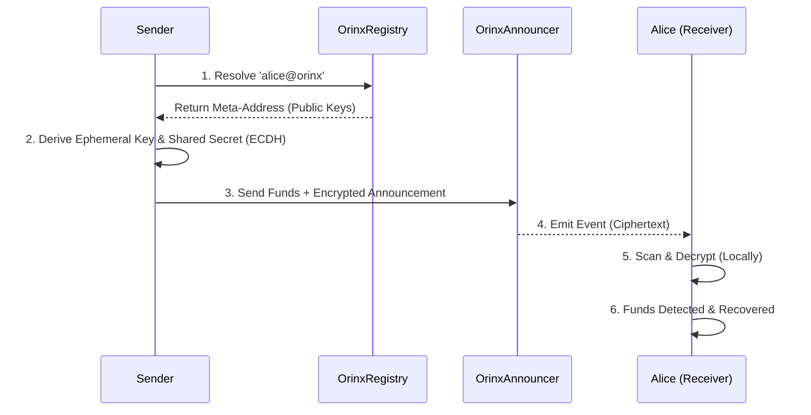

# Orinx on Etherlink 🔒

### The Privacy Layer for the EVM Era.
**Orinx** allows users to receive, hold, and send funds onchain while protecting their **financial privacy**.

## 🔐 Orinx at a Glance

- **Zero-Trust Architecture**: Privacy guarantees remain intact even if the blockchain, frontend, or all external infrastructure are fully observable.
- **Client-Side Privacy**: All sensitive cryptography and key derivation happens locally.
- **Non-Custodial**: Keys never leave the user’s device.
- **Recoverable**: Funds can always be recovered directly from the chain without Orinx UI.
- **Auditable**: Users can selectively disclose transaction history when required.

<div align="center">
  
  
  
  
</div>

<div align="center">
  
  
  
  
  
</div>

## ⚡ TL;DR
Orinx brings private payments to **Etherlink Shadownet** using stealth addresses. Stay **non-custodial**, avoid pooled funds, and keep every transaction **unlinkable**.

[▶️ **Watch the Demo Video**](https://youtu.be/TzzO6f4HdPQ)

> **"Privacy is not about hiding bad things. It's about protecting good people."**


## 🚫 The Problem: The Glass House

Blockchains are **architectures of surveillance**.

By default, every transaction you make—payments, salary, medical bills, donations—is broadcast to the world forever. Standard wallets don't just leak your data; they **dox** your entire financial life to:
*   **Ad Tech**: Building profiles of your net worth and spending habits.
*   **Bad Actors**: Targeting you for phishing or extortion based on your balance.
*   **Competitors**: Monitoring your business's cash flow and supply chain.

**Real finance requires confidentiality.** Orinx bridges the gap between transparent chains and the privacy we need.

---

## 🕶️ The Solution: Cryptographic Privacy

Orinx is an **on-chain privacy protocol** that brings **Stealth Addresses** to Etherlink.

We decouple your **Public Identity** from your **On-Chain Assets**.

1.  **Public Identity (The Meta-Address)**: You share a single, static ID (e.g., `alice@orinx`). Think of this as a **public instruction manual**. It tells people exactly how to generate a unique address for you, without you needing to be online.
2.  **Private Settlement**: When Bob pays you, the protocol mathematically derives a **unique, unlinked address** just for that payment.
3.  **Unified Dashboard**: Orinx aggregates all these scattered addresses into a single view. To you, it looks like one balance. To the blockchain, it looks like thousands of unrelated wallets.

---

## 🔥 Key Features

### 1. Fortress-Level Security 🏰
Orinx acts like a Hardware Wallet inside your browser.

*   **Isolated Execution**: All sensitive cryptography (signing, derivation) happens locally.
*   **Zero Leakage**: Your private keys **NEVER** leave your device. The UI "views" your balance but cannot touch your keys.
*   **"Scorched Earth" Policy**: If you close the tab, the keys are wiped from memory instantly. Nothing is persisted.

### 2. Smart 2FA (Identity Binding) 🔐
Your seed phrase isn't enough. Standard wallets have a fatal flaw: if someone steals your seed phrase, your money is gone.

Orinx implements Identity Binding:

*   We bind your wallet keys to a **PIN/Password** using high-hardness cryptography.
*   **The Result**: Even if an attacker steals your 12-word phrase, **they cannot access your Orinx funds** without your 2FA PIN/Password.
*   It is a **cryptographic second factor**, meaning your wallet address cannot be derived without your PIN.

### 3. Stealth Forwarding 🔄
Move funds from one stealth address to another—without ever touching a public exchange.

*   Pay a supplier, a friend, or an employee directly from your **unlinked** private balance.
*   The transaction remains mathematically **unlinked**.

### 4. Manual Recovery ("The Safety Net") 🚨
We believe in "Trust, but Verify". Orinx is non-custodial.

*   **Missed a scan?** The Manual Recovery tool scans the **entire blockchain history** to find your funds.
*   Even if our indexer goes down, your funds are always recoverable directly from the chain.

### 5. Privacy 📕
*   Even we (the developers) cannot see who you know and paid.

---

## 🚀 Why Etherlink?

Orinx + Etherlink is the perfect combination for the next generation of privacy-preserving applications.

### 1. Instant Finality (Low Latency) ⚡
Privacy usually means "slow" (waiting for mixers or ZK provers). On Etherlink, stealth payments feel **instant**. This low latency is critical for physical Point-of-Sale (POS) and high-frequency use cases.

### 2. Micro-Transaction Ready (Low Cost) 🪙
Traditional privacy layers are too expensive for small payments. Etherlink's ultra-low fees allow Orinx to support **tipping, gaming rewards, and micro-subscriptions** privately—use cases that were previously impossible.

---

## 🎯 Etherlink Focus Tracks

Orinx is built to accelerate the adoption of **Privacy** across key Etherlink verticals.

### 1. Stablecoin Payments & Financial Infrastructure 💸
Privacy is the missing piece of financial infrastructure. Businesses and individuals need to transact in stable assets (USDC, USDT, EURC) without exposing their entire net worth or supply chain.

*   **Stablecoin Native**: Orinx supports private transfers of any ERC-20 token on Etherlink.
*   **Payroll & Settlements**: Enable private salary payments in USDC.
*   **Merchant Payments**: Accept crypto for goods/services without doxxing your business treasury.

### 2. Gaming & Consumer Applications 🎮
We bring "Web2 Usability" to Web3 Privacy.

*   **Gaming Guilds**: Pay scholars and tournament winners privately to prevent on-chain sniping or targeting.
*   **Seamless Onboarding**: Our **Username System** (`alice@orinx`) replaces 42-character hex strings, making crypto accessible to non-technical users.
*   **Identity Layer**: A portable privacy layer that can settle payments for any consumer dApp on Etherlink.

---

## 🏗️ Technical Architecture

Orinx is built on a **"Trust Nothing"** architecture.

### 🛡️ Threat Model
Orinx is designed under a zero-trust threat model.
The blockchain and frontend are treated as untrusted, and privacy guarantees must hold even if all infrastructure except the client’s local worker is fully observable.

### The Transaction Lifecycle


### Smart Contract Architecture (Modular)
We split the logic to ensure future-proofing and security:
*   **`OrinxRegistry.sol` (Identity Layer)**: Immutable. Maps `@username` to `Meta-Address`. Enforces uniqueness and ownership.
*   **`OrinxAnnouncer.sol` (Stateless Payment Layer)**: Handles the flow of funds. It emits events for scanning but **holds no user state**, ensuring maximum gas efficiency.

### The Stack
*   **Frontend**: React, TypeScript, Viem, Wagmi.
*   **Cryptography**: `@noble/secp256k1`, `scrypt-js`, `hkdf` (Client-side execution).
*   **Contracts**: Solidity v0.8.28.
*   **Indexing**: The Graph (Decentralized Subgraph).

---

## 📊 Privacy Landscape

**Unlike mixers (e.g. Tornado Cash) or ZK wallets, Orinx avoids pooled funds and prover overhead.**

| Feature | Standard Wallet | Mixer (Tornado) | Orinx (Stealth) |
| :--- | :---: | :---: | :---: |
| **Privacy** | ❌ None | ✅ High | ✅ High |
| **Compliance** | ✅ High | ❌ Low (Sanctions) | ✅ High (Non-Custodial) |
| **User Experience** | ✅ Easy | ❌ Hard | ✅ Seamless |
| **Mobile Ready** | ✅ Yes | ❌ No | ✅ Yes |

---

## ⚠️ Limitations & Tradeoffs

Orinx provides strong on-chain privacy, but **not perfect anonymity**.

*   **Timing Correlations**: Stealth addresses do not hide *when* a transaction occurs.
*   **Client Security**: Privacy depends on your device not being compromised (e.g. keyloggers).
*   **Not a Mixer**: We do not pool funds. This offers better compliance but different privacy properties than Tornado Cash.
*   **Traceability (Feature)**: Unlike mixers, Orinx preserves the on-chain history of funds. This means you can prove the origin of unlimited funds to auditors (using your View Key) without doxxing yourself to the public.

> **"We believe honest disclosure is essential for legitimate financial privacy tools."**

---

## 🎨 Design Philosophy

*   **"Institutional Grade"**: We don't look like a toy. We look like a terminal.
*   **Dark Mode First**: Optimized for long sessions and privacy.
*   **Mobile Responsive**: The "Vault" fits in your pocket.

---

## 🧠 The Orinx Manifesto

**Why We Built This**: We aren't just building a wallet wrapper. We are building the **privacy layer for the future of finance**.

### 🏆 Our Unfair Advantage
We don't just write code; we ship products.

*   **Obsessive Security**: We built a custom **"Cold Worker"** architecture from scratch to isolate keys.
*   **Mobile-Native Experience**: We bring privacy to the **Mobile Era**. We optimized every interaction for touch devices because we know that **payments happen on the go**, not just on desktops.

### Core Values
*   **Privacy is a Human Right**: Not a feature toggle. It is the default state of a free society.
*   **Code over Trust**: We rely on **Elliptic Curve Cryptography**, not promises.
*   **Extreme Velocity**: We ship fast. If a feature blocks adoption, we build it.

> **"We bridge the gap between 'cypherpunk' tech and 'fintech' usability."**

---

## ✅ Transparency & Trust (Etherlink Deployment)

We believe privacy tools must be open and verifiable.

### Deployed Contracts (Etherlink Shadownet)

| Chain | Network ID | Contract | Address | Explorer |
| :--- | :--- | :--- | :--- | :--- |
| **Etherlink** | `127823` | **OrinxRegistry** | `0x6fb4986C0deb035d69d5089aE9824F2293aa02B0` | [View](https://shadownet.explorer.etherlink.com/address/0x6fb4986C0deb035d69d5089aE9824F2293aa02B0?tab=index) |
| **Etherlink** | `127823` | **OrinxAnnouncer** | `0xd6bf5AA102b7125CF7ee587F26d41963eD4999bA` | [View](https://shadownet.explorer.etherlink.com/address/0xd6bf5AA102b7125CF7ee587F26d41963eD4999bA?tab=index) |

### Network Configuration for Wallets

To interact with Orinx on Etherlink, ensure your wallet is configured with:

- **RPC URL**: `https://node.shadownet.etherlink.com`
- **Chain ID**: `127823`
- **Currency**: `XTZ`
- **Explorer**: `https://shadownet.explorer.etherlink.com/`

## 🚀 Try Orinx on Etherlink

**Send a private payment on Etherlink in under 60 seconds.**

1.  **Get Testnet XTZ**: Visit the [Etherlink Faucet](https://shadownet.faucet.etherlink.com/) to claim testnet tokens.
2.  **Connect**: Go to the [Orinx App](https://orinx.vercel.app/) and connect your wallet.
3.  **Register**: Claim your unique stealth username (e.g., `alice@orinx`).
4.  **Transact**: Send and receive private payments using XTZ or Tokens on Etherlink.


---

## ⚖️ "Good Actor" Compliance

Orinx is designed for **legitimate privacy**, not illicit evasion.

*   **Auditable Privacy**: Need to prove a payment for tax or audit purposes? Orinx allows you to **export your transaction history** in one click.
*   **Selective Disclosure**: You are in control. You can reveal specific transactions to counterparties or regulators without doxxing your entire financial life.
*   **Non-Custodial**: We never hold your funds.

---

## 🎯 Who Is Orinx For?

*   **DAOs**: Paying 15+ contributors weekly without exposing the treasury's full history.
*   **Freelancers**: Receiving salary in USDC without clients tracking their net worth.
*   **Founders**: Paying for operational expenses without leaking runway data.
*   **Traders**: Keeping alpha strategies private from copy-traders.
*   **Crowdfunding**: Raising funds for a sensitive cause without exposing every donor's identity.
*   **Friends & Family**: Splitting dinner bills or sending gifts without revealing your main wallet balance.

---

### Orinx Contracts (Etherlink)

This repository contains the core smart contracts for the Orinx protocol on Etherlink.

- `OrinxAnnouncer.sol`: Handles stealth payment announcements and fee collection.
- `OrinxRegistry.sol`: Manages username to stealth meta-address mappings.

### Setup

```bash
# Clone the repository
  git clone https://github.com/orinx-org/orinx-contracts-etherlink.git

# Navigate to the contracts
  cd orinx-contracts-etherlink

# Install dependencies:
  npm install

# Configure environment variables:
  - Copy `.env.example` to `.env`
  - Set `PRIVATE_KEY`, `ETHERLINK_RPC_URL`, and `ETHERSCAN_API_KEY`.
```

### Usage

Compile contracts:
```bash
npx hardhat compile
```

Run tests:
```bash
npx hardhat test
```

### Deployment

To deploy to Etherlink:
1.  Ensure `.env` is configured with `PRIVATE_KEY` and `ETHERLINK_RPC_URL`.
2.  Run the deployment script:
    ```bash
    npx hardhat run scripts/deploy.ts --network etherlink
    ```
    This will deploy `OrinxRegistry` and `OrinxAnnouncer` and log their addresses.

## Verification

The project includes a test suite for core functionality.
```bash
npx hardhat test
```
Expected output:
```
  Orinx Protocol
    OrinxRegistry
      ✔ Should register a username
      ✔ Should revert if username is taken
    OrinxAnnouncer
      ✔ Should emit Announcement event
```

---


## 🤝 Contributing

We are open source and welcome contributions!

1.  **Fork** the repository.
2.  Create a **Feature Branch** (`git checkout -b feature/amazing-feature`).
3.  **Commit** your changes (`git commit -m 'Add some amazing feature'`).
4.  **Push** to the branch (`git push origin feature/amazing-feature`).
5.  Open a **Pull Request**.

---

## 💬 Community & Support

Join the conversation and build the future with us.

*   [**Twitter (@OrinxProtocol)**](https://x.com/OrinxProtocol)

> **"We build in public. Come say hi."**

### Contributors


---

## 📄 License

Distributed under the **MIT License**. See `LICENSE` for more information.

---

## ❓ FAQ

- **Q: Which wallets is Orinx compatible with?**

  **A:** Orinx works alongside your existing wallet. It is compatible with **MetaMask**, **Rainbow**, **Coinbase Wallet**, and any WalletConnect-enabled wallet.    

- **Q: Is Orinx meant to hide illicit activity?**

  **A: No.** Orinx is designed for **legitimate financial privacy**. It is **non-custodial** and supports **selective disclosure**.

- **Q: Can I use Orinx for taxes and accounting?**

  **A: Yes.** You can export your full transaction history in one click.

- **Q: Is this a Mixer (like Tornado Cash)?**

  **A: No.** Mixers pool funds. Orinx uses **Stealth Addresses** to derive unique, unlinked addresses for every payment. Your funds never mix with others.

---

<p align="center">
  <b>Built by founders, for the future.</b><br>
  <i>Secure. Private. Unstoppable.</i>
</p>
